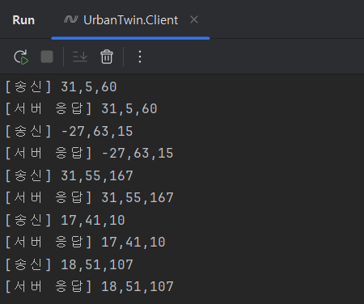
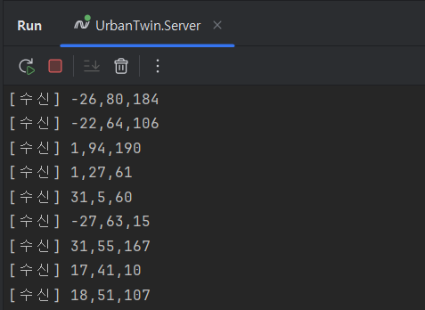
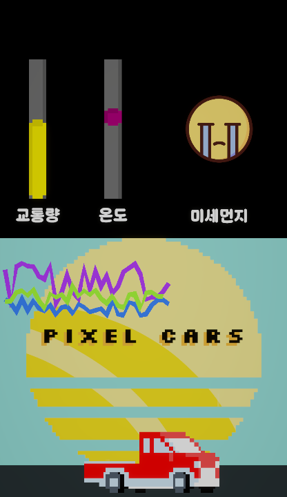

# UrbanTwin - 디지털트윈 & IoT 데이터 시각화 (기본 버전)

## 프로젝트 개요

**UrbanTwin**은 가상의 IoT 센서 데이터를 생성하고, 이를 서버를 통해 Unity 클라이언트에서 실시간 시각화하는 **디지털트윈 데모 프로젝트**입니다.
센서 시뮬레이터(Client) → 서버(Server) → Unity 클라이언트(Unity)로 이어지는 기본적인 데이터 파이프라인을 구현했습니다.

---

## 구현된 기능

### 1. 센서 시뮬레이터 (UrbanTwin.Client)

* 온도, 교통량, 미세먼지 데이터를 랜덤 생성
* TCP 소켓을 통해 서버(`127.0.0.1:12345`)로 데이터 전송
* 서버 응답 수신 후 콘솔 출력

### 2. 서버 (UrbanTwin.Server)

* TCP Listener 기반 서버
* 다중 클라이언트 연결 관리
* 클라이언트에서 수신한 데이터를 그대로 브로드캐스트 (Echo/중계 역할)

### 3. Unity 클라이언트 (UrbanTwin.Unity)

* 서버에 TCP 클라이언트로 연결하여 데이터 실시간 수신
* 수신 데이터(`"온도,교통량,미세먼지"`) 파싱 후 UI에 반영

**UI 시각화**

* 온도: Scrollbar 게이지 + 핸들 색상 변화 (파랑 ↔ 빨강 보간)
* 교통량: Scrollbar 게이지 + 색상 변화 (녹 → 노랑 → 빨강)
* 미세먼지: 상태 아이콘 교체 (매우 좋음 / 좋음 / 나쁨 / 매우 나쁨)

**히스토리 차트**

* LineRenderer 기반 그래프
* 센서별(온도/교통량/미세먼지) 로그형 차트 구현
* 일정 개수 이상 데이터는 자동 삭제 → 최근 데이터만 유지

---

## 기술 스택

* **언어**: C# (.NET 6, Unity 2022 LTS)
* **네트워크**: TCP/IP
* **시각화**: Unity UI, LineRenderer

---

## 실행 방법

### 1. 서버 실행

```bash
cd UrbanTwin.Server
dotnet run
```

### 2. 센서 시뮬레이터 실행

```bash
cd UrbanTwin.Client
dotnet run
```

### 3. Unity 클라이언트 실행

* `Unity/` 폴더를 Unity Editor로 열기
* `SampleScene` 실행 → 실시간 데이터 수신 및 UI 업데이트 확인

---

## 실행 흐름

```
[UrbanTwin.Server] → [UrbanTwin.Client] → [UrbanTwin.Unity]
```

## 🖼 실행 화면 예시

| UrbanTwin.Client (센서 시뮬레이터)                                                     | UrbanTwin.Server (TCP 서버)                                                         | UrbanTwin.Unity (시각화)                                                                |
| ------------------------------------------------------------------------------- | --------------------------------------------------------------------------------- | ------------------------------------------------------------------------------------ |
|  <br/> 센서 데이터(온도·교통량·미세먼지) 송신 |  <br/> 서버에서 데이터 수신 및 Echo/브로드캐스트 |  <br/> Unity UI 게이지·아이콘·히스토리 차트 시각화 |


